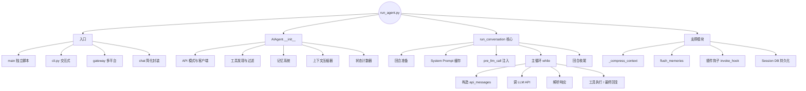
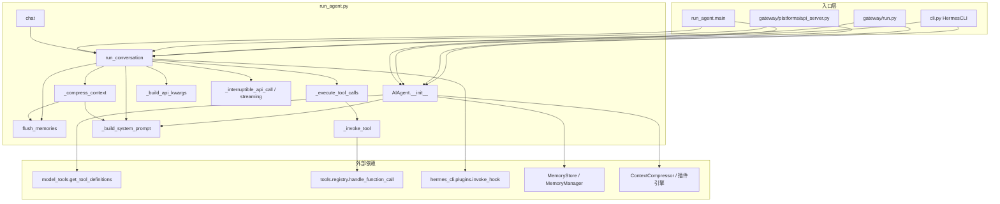
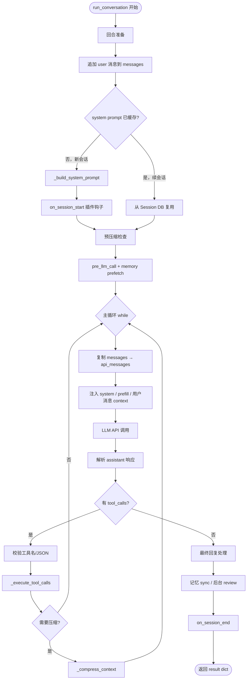
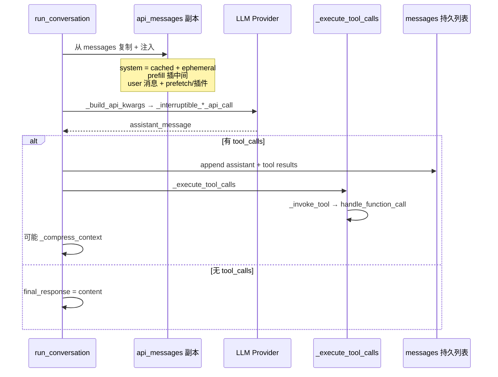
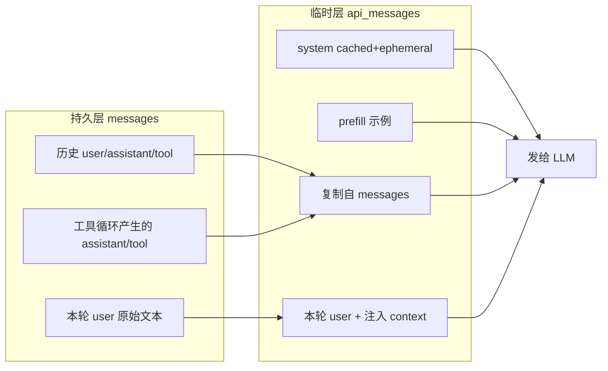

# run_agent.py 流程详解

> 文件约 1 万行，核心是 `AIAgent` 类。CLI / Gateway / API Server 都通过 `AIAgent(...)` + `run_conversation()` 驱动对话。

---

## 一、总览思维导图

> 说明：Mermaid 的 `mindmap` 语法在部分预览器（旧版 GitHub、部分 IDE）不支持，此处改用兼容性更好的 `flowchart` 树形图表达同样结构。



---

## 二、谁调用谁（入口 → 核心）



| 调用方 | 典型场景 |
|--------|----------|
| `cli.py` | 本地交互，`self.agent.run_conversation(...)` |
| `gateway/run.py` | Telegram/Discord 等，**每条消息常新建 Agent**，传入 `conversation_history` |
| `run_agent.main()` | 独立脚本一次性跑 query |
| `AIAgent.chat()` | 只返回 `final_response` 字符串的薄封装 |

---

## 三、AIAgent.__init__ 初始化流程

**位置**：`run_agent.py:512` 起，构造函数很长，可按阶段理解。


### 3.1 各阶段作用

| 阶段 | 关键代码 | 作用 |
|------|----------|------|
| API 模式 | `api_mode` 推断 | 三选一：`chat_completions` / `codex_responses` / `anthropic_messages` |
| 客户端 | OpenAI SDK / Anthropic adapter | 按 provider 注入 header、OAuth 刷新、credential pool |
| 工具 | `get_tool_definitions()` | 按 toolset 过滤，得到 `self.tools` + `self.valid_tool_names` |
| 记忆 | `MemoryStore` + `memory.provider` | 本地 MEMORY.md/USER.md + 可选外部 Honcho 等 |
| 压缩 | `ContextCompressor` 或插件 | 上下文逼近上限时摘要中间历史 |
| 状态 | `_user_turn_count`、`_cached_system_prompt`、`IterationBudget` 等 | 跨回合追踪 nudge、flush、缓存 |

### 3.2 重点

- **`valid_tool_names`** 决定模型能调哪些工具，也影响 system prompt 里注入哪些行为指导。
- **`_cached_system_prompt = None`**：首轮 `run_conversation` 才构建，续会话从 Session DB 恢复，保证 Anthropic 前缀缓存一致。
- Gateway **每条消息新建 Agent** 时，nudge 计数器在 `__init__` 初始化，需在多次 `run_conversation` 间保持的变量不能放在 `run_conversation` 开头重置。

---

## 四、run_conversation() — 主流程（重点）

**位置**：`run_agent.py:7393`  
**职责**：处理**一条用户消息**，可能包含多轮 API 调用（工具循环），直到产出最终回复或中断。

### 4.1 整体流程图



### 4.2 回合准备（进入主循环前）

| 步骤 | 函数/变量 | 说明 |
|------|-----------|------|
| 清理输入 | `_sanitize_surrogates` | 去掉无效 Unicode 代理对 |
| 重置预算 | `IterationBudget(max_iterations)` | 每用户消息重置，避免上轮 subagent 耗尽 |
| 初始化 messages | `list(conversation_history) + user_msg` | 不改调用方传入的 history |
| 用户回合 +1 | `_user_turn_count += 1` | 用于 `flush_memories` 最低轮次门槛 |
| 记忆 nudge | `_turns_since_memory` | 达间隔则 `_should_review_memory = True` |
| 记录索引 | `current_turn_user_idx` | **本轮** user 消息下标，注入 context 用 |
| System prompt | `_cached_system_prompt` | 新会话构建 + `on_session_start`；续会话读 DB |
| 预压缩 | `_compress_context` | 历史已超限则进主循环前先压 |
| 插件召回 | `invoke_hook("pre_llm_call")` | 返回内容拼到**本轮 user 消息**后 |
| 记忆预取 | `_memory_manager.prefetch_all` | 同上，不进 system prompt |

### 4.3 主循环 `while`（工具调用循环）

条件：`api_call_count < max_iterations` 且 `iteration_budget.remaining > 0`（另有宽限调用 `_budget_grace_call`）。

每一轮迭代：



#### 4.3.1 构造 `api_messages`（与 `messages` 分离）

| 内容 | 写入位置 | 是否持久化 |
|------|----------|------------|
| `active_system_prompt` | system 消息 | 缓存部分存 DB |
| `ephemeral_system_prompt` | 拼在 system 后 | **不存** |
| `prefill_messages` | system 后、历史前 | **不存** |
| prefetch / 插件 context | **本轮 user 消息 content 末尾** | **不存** |
| 对话历史 | 其余 messages | 存 Session DB |

> **设计重点**：插件/记忆 context 不进 system prompt，保持 prefix cache 稳定。

#### 4.3.2 API 调用链

```
_build_api_kwargs(api_messages)
  → invoke_hook("pre_api_request")
  → _interruptible_streaming_api_call  （优先流式）
      或 _interruptible_api_call
        → codex: _run_codex_stream
        → anthropic: _anthropic_messages_create
        → 其他: client.chat.completions.create
  → invoke_hook("post_api_request")
```

- 支持 **中断**：独立线程发请求，主线程轮询 `_interrupt_requested`。
- 内层 **retry 循环**（最多 3 次）：429、413 压缩、认证刷新、fallback 链等。

#### 4.3.3 工具执行链

```
_execute_tool_calls
  ├─ _should_parallelize_tool_batch? 
  │    ├─ 是 → _execute_tool_calls_concurrent（线程池）
  │    └─ 否 → _execute_tool_calls_sequential
  └─ _invoke_tool(name, args)
       ├─ todo / memory / clarify / delegate_task（内置）
       ├─ _memory_manager.handle_tool_call（外部记忆工具）
       └─ handle_function_call（registry 分发）
```

执行前：`pre_tool_call` 钩子；执行后：`post_tool_call` 钩子（在 registry 层）。

#### 4.3.4 无工具调用 → 结束循环

- `final_response = assistant_message.content`
- 处理空回复、thinking-only prefill、fallback 到上轮 `_last_content_with_tools`
- `break` 跳出 while

### 4.4 回合收尾

| 步骤 | 函数 | 说明 |
|------|------|------|
| 持久化 | `_persist_session` → `_flush_messages_to_session_db` | 写 SQLite |
| 轨迹 | `_save_trajectory` | 可选 JSONL |
| 记忆同步 | `_memory_manager.sync_all` | 外部记忆写回 |
| 后台审查 | `_spawn_background_review` | 达 nudge 间隔时审查 memory/skill |
| 插件 | `invoke_hook("on_session_end")` | 每轮都触发，非整个 CLI 会话结束 |
| 返回 | `result` dict | `final_response`、`messages`、`completed`、`interrupted`、token 统计等 |

---

## 五、关键子系统调用关系

### 5.1 System Prompt 构建

```
_build_system_prompt(system_message)
  ├─ 模型/平台行为指导（TOOL_USE、Gemini、GPT 等）
  ├─ SOUL.md / AGENTS.md / .cursorrules（可 skip）
  ├─ MemoryStore → MEMORY.md / USER.md
  ├─ MemoryManager.build_system_prompt()
  ├─ build_skills_system_prompt()
  └─ 工具列表说明等

触发重建：
  _invalidate_system_prompt() ← _compress_context 压缩后
```

### 5.2 上下文压缩

```
_compress_context(messages, ...)
  ├─ flush_memories(messages, min_turns=0)   # 压缩前强制保存记忆
  ├─ memory_manager.on_pre_compress()
  ├─ context_compressor.compress()         # 摘要中间消息
  ├─ _invalidate_system_prompt + _build_system_prompt
  └─ Session DB：end_session + create_session（会话 lineage 拆分）
```

### 5.3 记忆 flush

```
flush_memories(messages, min_turns?)
  ├─ 门槛：_user_turn_count >= flush_min_turns（默认 6）
  ├─ 追加临时 user 消息，只允许 memory 工具
  └─ 调用 LLM 一次，完成后清除 flush 消息
```

触发时机：CLI 退出、Gateway 会话切换、`/reset`、**压缩前**（`min_turns=0`）。

### 5.4 插件钩子时间线（单轮 run_conversation）

| 钩子 | 时机 | 返回值 |
|------|------|--------|
| `on_session_start` | 新会话首次构建 system prompt 后 | 忽略 |
| `pre_llm_call` | 主循环前，每用户消息一次 | `context` → 注入 user 消息 |
| `pre_api_request` | 每次 API 请求前 | 忽略 |
| `post_api_request` | 每次 API 响应后 | 忽略 |
| `pre_tool_call` / `post_tool_call` | 工具执行前后 | 忽略 |
| `on_session_end` | 本轮 run_conversation 结束 | 忽略 |

---

## 六、messages vs api_messages（必记）



- **`messages`**：真相源，写 Session DB、写日志。
- **`api_messages`**：每次 API 调用的快照，注入内容用完即弃。

---

## 七、重点设计决策速查

| 主题 | 做法 | 原因 |
|------|------|------|
| System prompt 缓存 | 同会话复用 `_cached_system_prompt`，续会话读 DB | Anthropic prefix cache 省钱 |
| Context 注入位置 | prefetch / 插件 → **user 消息** | 不破坏 system 前缀 |
| ephemeral / prefill | 只进 `api_messages` | 不污染轨迹和 DB |
| Gateway 每消息新 Agent | history 从 DB 传入 | 隔离并发；system prompt 必须从 DB 恢复 |
| 工具并发 | 读操作或无路径冲突时可并行 | 降延迟 |
| 压缩时会话拆分 | 新 `session_id`，parent 链接 | DB 索引与 lineage |
| on_session_end 每轮触发 | 不在此 shutdown memory provider | 避免第二条消息前杀 provider |
| 中断 | `_interrupt_requested` + API 线程断连 | 用户 /stop、新消息插队 |

---

## 八、核心函数速查表

| 函数 | 行号约 | 作用 |
|------|--------|------|
| `AIAgent.__init__` | 512 | 一次性配置：客户端、工具、记忆、压缩器 |
| `run_conversation` | 7393 | **主入口**：一条用户消息的完整处理 |
| `_build_system_prompt` | 3001 | 组装 system prompt 各块 |
| `_compress_context` | 6464 | 上下文压缩 + 会话拆分 |
| `flush_memories` | 6313 | 压缩/退出前保存长期记忆 |
| `_build_api_kwargs` | 5851 | 组装 model/tools/stream 等 API 参数 |
| `_interruptible_api_call` | 4629 | 可中断的非流式 API |
| `_interruptible_streaming_api_call` | 4784 | 可中断的流式 API |
| `_execute_tool_calls` | 6563 | 串行/并发工具调度 |
| `_invoke_tool` | 6584 | 单工具分发（内置 + registry） |
| `_persist_session` | 2180 | 持久化到 Session DB |
| `_spawn_background_review` | 2066 | 后台 memory/skill 审查 |
| `chat` | 9984 | `run_conversation` 薄封装 |
| `main` | 9999 | 独立脚本入口 |

---

## 九、建议阅读顺序

1. `AIAgent.__init__`（512–1420）— 弄清 agent 带什么状态进对话  
2. `run_conversation` 开头到主循环前（7393–7675）— 回合准备、prompt、注入  
3. 主循环内「构造 api_messages + API 调用」（7733–9110）  
4. 工具分支（9220–9514）与最终回复分支（9516–9700）  
5. 回合收尾（9900–9982）  
6. 按需深入：`_compress_context`、`flush_memories`、`_build_system_prompt`

配合 [阶段二.md](./阶段二.md) 中 system prompt 与 nudge 计数器章节一起读效果更好。
