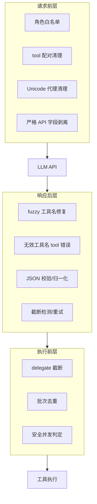

# 用三层修复层容错模型工具调用协议错误

## 1. 背景与场景

模型函数调用协议要求：assistant `tool_calls` 与 tool 结果严格配对；工具名必须在当前可用集合内；参数必须是合法 JSON；批量调用不能重复执行有副作用的操作，也不能不安全并发。

长会话智能体的历史可能来自数据库恢复、上下文压缩或跨 API 模式迁移。模型本身也会幻觉工具名、输出截断 JSON、或在同一轮重复调用。任一环节出错都可能导致 API 400、误执行或会话中断。

## 2. 要解决的核心问题

| 失败点 | 后果 |
|--------|------|
| 孤立 tool 结果 / 缺失 tool 结果 | API 拒绝请求 |
| 无效 UTF-16 代理字符 | JSON 序列化崩溃 |
| 幻觉工具名 | 调用不存在 handler |
| 截断/非法 JSON 参数 | 半截参数误执行 |
| 同批重复 (name, args) | 重复副作用 |
| 不安全并发 | 文件/状态竞态 |

## 3. 可选方案

### 方案 A：完全信任模型输出

直接执行 tool_calls，历史原样送 API。

优点：代码最少。

代价：一次协议错误整轮失败；截断 JSON 可能执行危险默认值。

### 方案 B：请求前硬失败

配对不完整就拒绝发 API，让用户手动修 history。

优点：不掩盖数据问题。

代价：长会话不可用；无法从压缩/迁移中恢复。

### 方案 C：三层修复（本决策）

1. **请求前层**：清理消息形状（配对、Unicode、严格 API 字段）。
2. **响应后层**：校验工具名/参数，有限重试，截断拒绝执行。
3. **执行前层**：委托截断、去重、安全并发判定。

## 4. 决策与理由

选方案 C。

- 比 A 安全：有重试上限，截断参数不执行。
- 比 B 可用：自动 stub 缺失结果，允许模型自修复。
- 修复只作用于 **API 副本** 或 **当前轮响应**，不 silently 改持久化历史的语义（stub 除外且仅用于 API）。

放弃：无限重试（成本与循环风险）、无效 JSON 默认 `{}` 直接执行（仅在校验通过后执行阶段对 parse 失败兜底）、所有工具无脑并发。

## 5. 核心抽象

## 6. 适用条件

- 模型直接生成 tool_calls。
- 工具有副作用，需要并发守卫。
- 历史持久化且可能不完整。
- 需要给模型自修复机会，但有上限（默认 3 次）。

## 7. 不适用 / 反例

- 工具调用完全由强类型编排器生成、模型不参与 → 过度设计。
- 无工具纯聊天 → 整套可跳过。
- 需要审计级「绝不注入 stub 结果」→ 须改用硬失败而非自动补齐。

## 8. 已知代价

- stub 工具结果不是真实执行结果，模型可能基于占位文本推理。
- fuzzy repair 可能误修正工具名（cutoff=0.7）。
- 并发判定保守：不在白名单的工具默认串行。
- 多层修复增加主循环复杂度，须保持计数器每 user turn 重置。

## 9. 落地要点

1. `_sanitize_api_messages` 每次 API 请求前无条件运行，只改 API 副本。
2. 无效工具名用 **tool role** 错误消息，不是 user 消息。
3. 无效 JSON 前 2 次不写入 history，直接 `continue` 重试 API。
4. 截断 JSON（非 `}`/`]` 结尾）拒绝执行，返回 partial。
5. 并发白名单 + 路径前缀重叠检测 + `_MAX_TOOL_WORKERS=8`。

## 10. 标签

tool-calling, protocol-repair, json-validation, concurrency-guard, retry-limit

## 附录：来源证据（仅供溯源核实，阅读正文无需依赖此节）

- `run_agent.py:3179-3245`：请求前 tool 配对清理。
- `run_agent.py:337-398`：Unicode 代理清理。
- `run_agent.py:3294-3320`：fuzzy 工具名修复。
- `run_agent.py:9239-9367`：无效工具名/JSON 校验循环。
- `run_agent.py:3248-3292`：delegate 截断与去重。
- `run_agent.py:264-305`：安全并发判定。
- `run_agent.py:6285-6311`：严格 API tool_calls 字段剥离。
