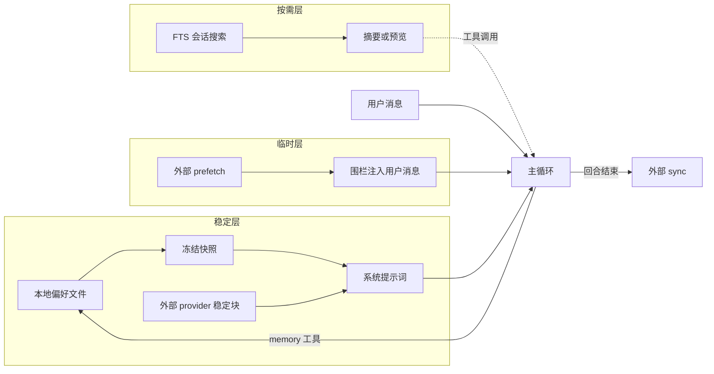

# 用三层记忆分工处理偏好情景和外部召回

## 1. 背景与场景

长会话智能体需要三类不同生命周期的信息：

1. **跨会话稳定偏好**：用户角色、沟通风格、环境事实、项目惯例。
2. **按需情景回忆**：「上次怎么做的」「某次对话里讨论过什么」——体量大、不能常驻系统提示词。
3. **外部记忆服务召回**：由独立后端维护的向量库、用户画像或第三方记忆 API 提供的补充上下文。

若把三类信息混进同一层（例如全部实时拼进系统提示词，或全部写进同一文件），会出现：前缀缓存频繁失效、任务进度污染长期偏好、历史全文撑爆窗口、外部召回与真实用户输入混淆。

## 2. 要解决的核心问题

| 混用方式 | 后果 |
|----------|------|
| 任务进度写入长期偏好存储 | 偏好文件膨胀，下一会话仍携带已过期任务状态 |
| 历史会话全文注入系统提示词 | token 成本不可控，且与当前对话重复 |
| 外部召回写入系统提示词前缀 | 每轮查询变化导致缓存失效 |
| 外部召回持久化到会话历史 | 过期召回在后续轮次重复回放 |
| 长期偏好在会话中途实时改系统提示词 | 规则漂移，前缀缓存失效 |

## 3. 可选方案

### 方案 A：单一记忆文件 + 全量注入

所有「值得记住的」内容写入一个文件，每轮或每次会话开始全量读入系统提示词。

优点：实现简单。

代价：无法区分偏好与情景；写入即改前缀；文件无限增长。

### 方案 B：只靠 RAG / 向量库，不做本地偏好层

所有记忆走检索，按需召回。

优点：存储可扩展。

代价：稳定偏好每轮都要检索才能生效；检索失败时行为不一致；审计与人工编辑困难。

### 方案 C：三层分工（本决策）

- **层 1 本地冻结偏好**：文件-backed、有字符上限、加载时冻结进系统提示词快照；会话内写入只更新磁盘与 live 状态，不改当前快照。
- **层 2 情景召回**：全文检索历史会话 → 聚合 lineage → 摘要或降级预览；按需工具调用，不默认注入。
- **层 3 外部编排**：provider 的 stable 块进系统提示词；每轮 prefetch 结果围栏注入当前用户消息副本；回合结束 sync。

## 4. 决策与理由

选择方案 C。

关键权衡：

- **稳定性 vs 实时性**：层 1 牺牲「写入后立刻进系统提示词」，换取整会话前缀稳定；刷新边界明确放在压缩后或新会话。
- **成本 vs 相关性**：层 2 用摘要而非 raw 全文，控制 token；空查询只列元数据不调模型。
- **扩展 vs 复杂度**：层 3 限制同时只有一个外部 provider，避免工具 schema 膨胀与冲突。

## 5. 核心抽象

```
┌─────────────────────────────────────────────────────────┐
│ 稳定系统提示词快照（会话级，压缩后可刷新）                    │
│  ├─ 层1：本地偏好块（MEMORY / USER 冻结快照）              │
│  └─ 层3-stable：外部 provider 的 system_prompt_block    │
└─────────────────────────────────────────────────────────┘
                          +
┌─────────────────────────────────────────────────────────┐
│ 当前轮请求副本（不持久化）                                  │
│  ├─ 层3-ephemeral：prefetch → <memory-context> 围栏       │
│  └─ 插件/其它 ephemeral 注入                              │
└─────────────────────────────────────────────────────────┘
                          +
┌─────────────────────────────────────────────────────────┐
│ 按需工具（不默认注入）                                      │
│  └─ 层2：session_search → FTS → 摘要 / recent 浏览        │
└─────────────────────────────────────────────────────────┘
```

**职责分界（写入路由）**：

| 信息类型 | 应写入 | 不应写入 |
|----------|--------|----------|
| 用户偏好、纠正、环境事实 | 层 1 本地偏好 | 层 2 情景召回 |
| 任务进度、已完成工作日志 | 层 2（留在 transcript） | 层 1 |
| 可复用工作流 / 多步方法 | 技能存储 | 层 1 |
| 第三方后端维护的用户模型 | 层 3 provider | 层 1 文件 |

## 6. 通用结构图



## 7. 适用条件

- 智能体有多轮会话、工具调用、会话持久化。
- 关注系统提示词前缀缓存或行为一致性。
- 历史会话数量大到无法全量注入。
- 可能需要对接一个外部记忆后端，但不是强依赖。

## 8. 不适用 / 反例

- 强实时记忆：同一事务内写入后必须立刻影响下一 API 调用的系统规则（应改用 live 注入或事务级状态）。
- 审计级记忆：要求每次写入立刻可追溯到系统提示词版本（需额外版本化，不能只用冻结快照）。
- 多外部记忆后端并行：本决策假设最多一个外部 provider。

## 9. 已知代价

- 层 1 写入后当前会话内系统提示词不可见新条目；需依赖工具响应 live 状态或等压缩/新会话刷新。
- 层 2 摘要可能丢细节，关键事实需打开原会话核验。
- 层 3 增加 provider 生命周期管理（prefetch / sync / compress 钩子）。
- 三层边界需要在工具 schema 描述中明确，否则模型仍会写错层。

## 10. 落地要点

1. 本地偏好：加载时捕获快照；`format_for_system_prompt()` 只读快照；工具写入更新 live + 磁盘。
2. 情景召回：独立搜索工具；排除当前 lineage；空查询只返回 recent 元数据。
3. 外部记忆：`prefetch` 结果围栏注入用户消息副本；`sync` 在最终回复交付后；压缩前 `on_pre_compress`。
4. 自动沉淀：主响应后后台审查线程，不阻塞交付。
5. 压缩边界：`flush` → `on_pre_compress` → 压缩 → 失效快照 → `load_from_disk` → 重建系统提示词。

## 11. 标签

memory, session-recall, prompt-layering, three-tier, frozen-snapshot, fts, external-provider

## 附录：来源证据（仅供溯源核实，阅读正文无需依赖此节）

- `tools/memory_tool.py:5-24`：MEMORY/USER 双文件、冻结快照设计说明；schema 规定任务进度不进 memory。
- `tools/memory_tool.py:100-135`：`_system_prompt_snapshot` 与 live entries 并行。
- `agent/memory_manager.py:54-69`：`build_memory_context_block()` 围栏注入。
- `agent/memory_manager.py:79-108`：只允许一个 external provider。
- `tools/session_search_tool.py:265-268`：空查询 recent 模式不调 LLM。
- `run_agent.py:3083-3099`：本地快照 + 外部 system block 进 `_build_system_prompt()`。
- `run_agent.py:7742-7755`：prefetch 注入用户消息 API 副本。
- `run_agent.py:6313-6462`：压缩前 `flush_memories()`。
- `run_agent.py:3322-3331`：`_invalidate_system_prompt()` 重载快照。
