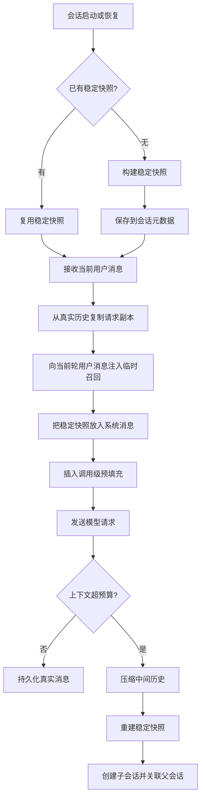

# 用稳定系统提示词与临时上下文分层保持长会话智能体稳定

## 1. 背景与场景

长会话智能体会同时承载几类信息：身份与行为规则、工具能力说明、用户偏好、当前任务召回、插件或外部系统提供的临时上下文、对话历史、工具调用结果。若把这些信息每轮重新拼成一个大提示词，系统会面对两个问题：

1. 高频变化的信息会改写提示词前缀，使缓存难以命中。
2. 会话中途加入的新上下文会改变模型对规则、身份和任务边界的理解，造成行为漂移。

这个决策适用于需要长期运行、多轮工具调用、会话恢复、跨入口交付，并且关注成本与行为一致性的智能体运行时。

## 2. 要解决的核心问题

核心问题不是“提示词要不要包含更多上下文”，而是“不同生命周期的信息是否被放在正确层级”。做错会出现以下后果：

- 把每轮召回内容放进系统提示词：系统前缀频繁变化，缓存失效，输入 token 成本上升。
- 把长期规则写进普通用户消息：规则权重下降，并且容易被后续用户输入覆盖。
- 把临时插件上下文持久化到会话历史：下一轮会重复回放已经过期的上下文，污染检索和压缩。
- 压缩历史时不重建稳定层快照：压缩后长期记忆与会话状态可能不同步。

## 3. 可选方案

### 方案 A：每轮全量重建大提示词

每次请求都读取配置、长期记忆、技能索引、上下文文件、插件召回与历史摘要，然后拼成新的系统提示词。

优点：实现直接，所有信息都能即时生效。

代价：任何文件、记忆或临时召回变化都会改动前缀；缓存收益低；系统身份和规则容易在会话中途漂移。

### 方案 B：只使用固定系统提示词，不做临时注入

系统提示词在会话开始时固定，后续只追加对话历史。

优点：前缀稳定，行为一致。

代价：不能向当前轮补充外部召回、插件结果、任务相关记忆；长会话中上下文相关性下降。

### 方案 C：稳定系统提示词与临时上下文分层

把身份、工具说明、长期记忆快照、技能索引、平台规则等低频变化信息冻结为系统提示词快照；把外部召回、插件上下文、少样本预填充等高频变化信息只注入本次 API 请求副本；会话历史只保存真实用户、模型与工具消息。

## 4. 决策与理由

采用方案 C。

决策理由是把信息按生命周期分层，而不是按“对模型有没有用”统一塞进同一位置：

- 稳定层承载身份、规则、工具指导和长期记忆快照。它在会话内复用，保证模型看到的高优先级指令不随轮次漂移。
- 临时层承载本轮召回和插件上下文。它只参与当前 API 调用，不进入会话持久化，避免过期内容被下一轮再次消费。
- 历史层承载真实交互与工具结果。它是可持久化、可搜索、可压缩的事实源。
- 压缩边界是允许重建稳定层的时机。压缩会改变历史形态，缓存前缀本来就会变化，此时重新加载长期记忆并生成新的稳定快照，成本与一致性更匹配。

该决策放弃的是“所有外部状态即时进入最高优先级提示词”的简单性，换来缓存命中、会话行为稳定和可恢复性。

## 5. 核心抽象

核心抽象是“上下文生命周期分层”：

- **稳定快照**：会话级，高优先级，可缓存，可持久化为会话元数据。
- **请求副本**：调用级，只存在于一次模型请求中，可以注入临时召回、插件上下文或预填充示例。
- **会话事实**：历史级，保存用户、助手、工具消息，是搜索、恢复和压缩的输入。
- **压缩分叉**：当历史超过上下文预算时，把旧会话结束为父片段，新会话继承摘要与新的稳定快照。

## 6. 通用结构图

## 7. 适用条件

适合以下条件同时成立的系统：

- 会话会持续多轮，且每轮可能包含多次模型调用或工具调用。
- 系统提示词较长，包含工具说明、平台规则、长期记忆或技能索引。
- 存在高频变化的临时上下文，例如外部记忆召回、插件结果、用户当前环境。
- 需要在不同入口或进程中恢复同一会话。
- 成本或延迟受输入 token 影响明显。

## 8. 不适用 / 反例

以下场景不宜引入该分层复杂度：

- 一次性问答，没有会话恢复与工具循环。
- 系统提示词极短，缓存收益可以忽略。
- 所有上下文都必须立即长期生效，并且业务明确接受中途规则变化。
- 临时召回本身需要审计级持久化，此时不能只放请求副本，应设计独立审计日志。

## 9. 已知代价

- 需要维护两套消息视图：真实会话历史与 API 请求副本。
- 临时上下文默认不可追溯；若线上排障需要复现，需要额外日志记录请求副本或注入摘要。
- 稳定快照不会自动反映会话中途写入的长期记忆；必须明确“何时生效”。
- 压缩会话时要处理父子会话、摘要、快照重建、索引关系，状态管理更复杂。

## 10. 落地要点

1. 为每个会话保存一份稳定系统提示词快照，后续恢复时优先复用，而不是重新从磁盘或外部系统拼装。
2. 构造模型请求时先复制真实历史，再在副本上做注入，禁止把本轮临时上下文写回真实历史。
3. 外部召回和插件上下文只追加到当前轮用户消息；除非有明确证据证明它应成为长期规则，否则不进入系统提示词。
4. 少样本预填充只插入请求副本，位置应在系统消息之后、真实历史之前。
5. 上下文压缩前先保存重要长期记忆；压缩后允许重建稳定快照，并把新会话与父会话关联。
6. 若使用提示词缓存，在缓存断点上优先保护稳定系统提示词和最近少量非系统消息。

## 11. 标签

architecture, prompt-layering, context-management, prompt-cache, long-session, session-persistence

## 附录：来源证据（仅供溯源核实，阅读正文无需依赖此节）

- `run_agent.py:3001-3008`：`AIAgent._build_system_prompt()` 注释说明系统提示词每个会话构建一次，缓存在 `_cached_system_prompt`，仅在上下文压缩后重建。
- `run_agent.py:3009-3016`：系统提示词层次包括身份、用户/gateway 系统提示、持久记忆、技能指导、上下文文件、时间、平台提示。
- `run_agent.py:3078-3079`：`ephemeral_system_prompt` 不包含在 `_build_system_prompt()` 中，只在 API 调用时注入，不进入缓存/存储的系统提示词。
- `run_agent.py:7531-7564`：`run_conversation()` 在 `_cached_system_prompt` 为空时，续会话优先从 SQLite session row 的 `system_prompt` 恢复；新会话才调用 `_build_system_prompt()`，并写入 session DB。
- `run_agent.py:7742-7755`：外部记忆预取与插件上下文只注入当前轮 user 消息的 API 副本，`messages` 不变。
- `run_agent.py:7779-7794`：构造 `effective_system`、临时追加 `ephemeral_system_prompt`、插入 `prefill_messages`，均发生在 API 调用副本上。
- `run_agent.py:6496-6521`：压缩后调用 `_invalidate_system_prompt()`、重建新系统提示词，结束旧 session、创建带 `parent_session_id` 的新 session，并更新 system prompt。
- `run_agent.py:2180-2192`：`_persist_session()` 保存真实消息并刷入 SQLite。
- `agent/prompt_caching.py:41-72`：`apply_anthropic_cache_control()` 使用 system prompt + 最后 3 条非 system 消息的最多 4 个 cache_control 断点。
- `agent/memory_manager.py:146-184`：外部记忆提供者的系统提示块与 prefetch 结果分开收集，prefetch 失败不阻塞其他 provider。
- `hermes_state.py:41-68`：sessions 表包含 `system_prompt` 和 `parent_session_id` 字段。
- 证据不足：未在已核实源码中找到“约 75% 成本节省”的计量实现或基准测试；该数值只出现在代码注释和学习材料中，不能作为已验证性能结论。